# Sales Agent Testing Framework 🚀

> A State-Of-The-Art (SOTA) implementation of a scalable, AI-driven Sales Data Agent testing framework using Azure Fabric and OpenAI.

This project serves as a comprehensive suite for automating the deployment and rigorous quality assurance (QA) of a Generative AI Data Agent. It automates the extraction of dynamic enterprise data, handles massive cloud deployments, and leverages Language Models to auto-evaluate the performance of natural language to SQL (NL2SQL) accuracy.

---

## 💡 Business Value & Purpose

In enterprise environments, Generative AI applications (like NL2SQL Data Agents) must perform with extremely high accuracy and handle semantic ambiguity. This framework solves the "AI Testing Bottleneck" by:
1. **Automated Ground Truth Generation**: Generating business-relevant queries and their expected analytical outputs directly from the database schema.
2. **Deterministic Evaluation**: Utilizing an LLM-as-a-Judge to evaluate Agent responses against the Ground Truth, scaling QA from manual spot-checks to thousands of edge cases.
3. **Seamless CI/CD Integration**: Programmatically compiling agent instructions (up to API limits) and deploying artifacts directly to Microsoft Fabric OneLake using Zero-Trust Identity models (Azure SDK).

---

## 🏗️ Architecture

Below is the automated workflow powered by the framework:

```mermaid
graph TD
    classDef step fill:#e1f5fe,stroke:#01579b,stroke-width:2px;
    classDef agent fill:#f3e5f5,stroke:#4a148c,stroke-width:2px;
    classDef azure fill:#e8f5e9,stroke:#1b5e20,stroke-width:2px;

    DB[(Fabric SQL Endpoint)]:::azure

    subgraph Data Prep
        S1[01_prepare_data.py]:::step --> |Extract Samples| DB
        DB --> |Outputs| SD(sample_data_*.txt)
    end

    subgraph Agent Deployment
        S2[02_deploy_agent.py]:::step --> |Read Instructions| P(prompts/)
        S2 --> |Compile JSON| C(agent_config.json)
        C --> |Azure SDK Upload| OL[(Fabric OneLake)]:::azure
    end

    subgraph QA Execution Pipeline
        S3[03_run_qa.py]:::step
        S3 --> QG[1. Question Generation]
        S3 --> GT[2. Ground Truth Gen]
        S3 --> AE[3. Agent Execution]:::agent
        S3 --> EV[4. LLM Evaluation]
        
        QG --> |Generate Edge Cases| GT
        GT --> |Expected Answer| EV
        AE --> |Actual NL + SQL| EV
        EV --> |Score & Reason| RPT(QA Reports / CSV)
    end
```



---

## 🚀 Activity-Based Workflow

The project is organized into three primary execution logic scripts, all optimized with standard `logging`, `argparse`, and type hints:

1.  **[01] Data Preparation**
    - Script: `scripts/01_prepare_data.py`
    - Purpose: Fetch and sample distinct values from Fabric SQL Endpoints to `data/sample/`.

2.  **[02] Agent Publishing**
    - Script: `scripts/02_deploy_agent.py`
    - Purpose: Compile agent instructions and upload the configuration payload directly to Fabric OneLake.

3.  **[03] QA Execution**
    - Script: `scripts/03_run_qa.py`
    - Purpose: Execute the end-to-end QA pipeline (Generate -> GT -> Run -> Evaluate).

---

## 🛠️ Getting Started

### Prerequisites
- **Python**: 3.10+
- **Cloud Config**: Azure CLI (Authenticated)
- **Environment**: `.env` file with necessary API keys (`OPENAI_API_KEY`) and Fabric endpoints (`FABRIC_SQL_ENDPOINT`, `DATA_AGENT_URL`, `TENANT_ID`).

### Quick Start
```bash
# Step 1: Prepare data (Output defaults to data/sample)
python scripts/01_prepare_data.py

# Step 2: Deploy agent configuration to OneLake
python scripts/02_deploy_agent.py --workspace "your-workspace" --lakehouse "YOUR_LH"

# Step 3: Run full end-to-end QA tests
python scripts/03_run_qa.py
```

*Note: You can run specific QA steps using the `--step` flag (e.g., `python scripts/03_run_qa.py --step 1 --level L3 L4`).*

---

## 📂 Project Structure

```text
sales-agent-prod/
├── src/sales_agent/       # Core Python package (client, logic, utils).
├── scripts/               # Entry point scripts for data prep, deploy, and QA.
│   └── platform/          # Scripts intended for remote platforms (e.g., Fabric runners).
├── prompts/               # Functional AI instructions (Agent schema, QA levels).
├── data/
│   ├── sample/            # Dimension value samples
│   ├── agent/             # Compiled agent artifacts
│   └── qa/                # Step-by-step QA outputs and evaluation reports
├── logs/                  # Application and remote sync logs
├── pyproject.toml         # Dependency and linter configuration (Ruff)
└── README.md              # Project documentation
```

---
*Built as a professional implementation of Data Quality and Testing by a Data Engineer.*
