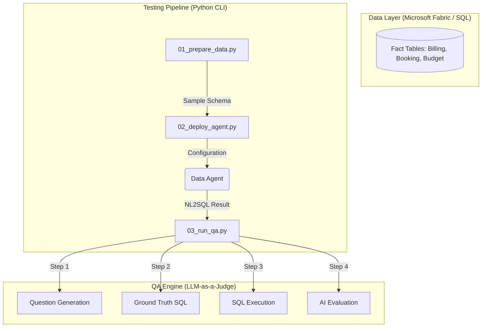

# Sales Agent Testing Framework 🚀

> A State-Of-The-Art (SOTA) implementation of a scalable, AI-driven Sales Data Agent testing framework using Azure Fabric and OpenAI.

This project serves as a comprehensive suite for automating the deployment and rigorous quality assurance (QA) of a Generative AI Data Agent. It automates the extraction of dynamic enterprise data, handles massive cloud deployments, and leverages Language Models to auto-evaluate the performance of natural language to SQL (NL2SQL) accuracy.

---

## 💡 Business Value & Purpose

In enterprise environments, Generative AI applications (like NL2SQL Data Agents) must perform with extremely high accuracy and handle semantic ambiguity. This framework solves the "AI Testing Bottleneck" by:
1. **Automated Ground Truth Generation**: Generating business-relevant queries and their expected analytical outputs directly from the database schema.
2. **Deterministic Evaluation**: Utilizing an LLM-as-a-Judge to evaluate Agent responses against the Ground Truth, scaling QA from manual spot-checks to thousands of edge cases.
3. **Seamless CI/CD Integration**: Programmatically compiling agent instructions (up to API limits) and deploying artifacts directly to Microsoft Fabric OneLake using Zero-Trust Identity models (Azure SDK).

---

## AI Data Agent Evaluator (NL2SQL QA Framework)

> [!NOTE]
> **Portfolio Version**: This repository has been anonymized. All business entities, customer names, and specific product lines have been replaced with generic placeholders (e.g., `REGION_A`, `CUSTOMER_X`) to protect proprietary data while showcasing the underlying architectural framework.

## 📈 Business Value & Context
This project provides a robust, professional-grade framework for **Generative AI Data Agents** (specifically NL2SQL solutions). In enterprise environments, ensuring that an LLM correctly translates natural language into complex SQL (handling joins, ratios, and business logic) is a critical challenge.

This framework automates the **Deployment, Data Preparation, and Multi-Level QA** pipeline to ensure high accuracy and reliability of AI-driven data insights.

## 🏗️ System Architecture


## 🚀 Technical Highlights
- **SOTA Data Instructions**: Implements a "Triple-Net Entity Resolution" protocol and "Quad-Net Product Search" to eliminate LLM hallucinations.
- **Automated QA Pipeline**: A 4-step pipeline that generates adversarial questions, matches them with ground-truth SQL, compares execution results, and uses an AI Evaluator to score accuracy.
- **Professional Tooling**:
    - **CLI Ready**: All scripts use `argparse` for modular execution.
    - **Quality Code**: Type hints, standard `logging`, and `ruff` linting/formatting.
    - **Zero-Trust Auth**: Integrated with Azure Identity & Service Principals.

## 🛠️ Getting Started

### Prerequisites
- **Python**: 3.10+
- **Cloud Config**: Azure CLI (Authenticated)
- **Environment**: `.env` file with necessary API keys (`OPENAI_API_KEY`) and Fabric endpoints (`FABRIC_SQL_ENDPOINT`, `DATA_AGENT_URL`, `TENANT_ID`).

### Quick Start
```bash
# Step 1: Prepare data (Output defaults to data/sample)
python scripts/01_prepare_data.py

# Step 2: Deploy agent configuration to OneLake
python scripts/02_deploy_agent.py --workspace "your-workspace" --lakehouse "YOUR_LH"

# Step 3: Run full end-to-end QA tests
python scripts/03_run_qa.py
```

*Note: You can run specific QA steps using the `--step` flag (e.g., `python scripts/03_run_qa.py --step 1 --level L3 L4`).*

---

## 📂 Project Structure

```text
sales-agent-prod/
├── src/sales_agent/       # Core Python package (client, logic, utils).
├── scripts/               # Entry point scripts for data prep, deploy, and QA.
│   └── platform/          # Scripts intended for remote platforms (e.g., Fabric runners).
├── prompts/               # Functional AI instructions (Agent schema, QA levels).
├── data/
│   ├── sample/            # Dimension value samples
│   ├── agent/             # Compiled agent artifacts
│   └── qa/                # Step-by-step QA outputs and evaluation reports
├── logs/                  # Application and remote sync logs
├── pyproject.toml         # Dependency and linter configuration (Ruff)
└── README.md              # Project documentation
```

---
*Built as a professional implementation of Data Quality and Testing by a Data Engineer.*
